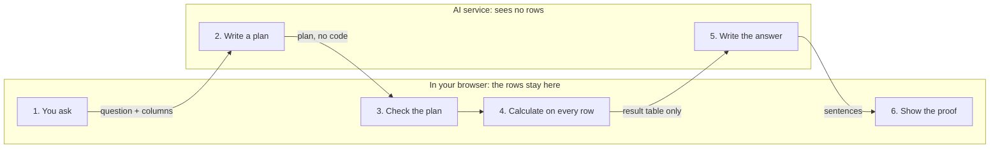

# LUMIQ — Fix PRD

Oct 5, 2026 · Saksham Srivastava

## 1. Verdict

LUMIQ today is a good-looking demo, not a product: the AI sees only the first 5 to 10 rows of a file, so most numbers it gives are guesses. This PRD fixes that first, then cuts the product down to one promise it can keep.

**The one promise:** ask your spreadsheet a question in plain words and get an answer you can check.

Three decisions this PRD makes:

- **Numbers come from code, words come from AI.** The browser calculates every figure on all rows. The AI only decides what to calculate and explains the result.
- **No AI-written code is ever run.** The current filter runs whatever JavaScript the model returns. That goes away.
- **Fewer screens, plain names.** Seven tabs with names like Oracle, Scenario Forge and Data DNA become three screens anyone understands: Overview, Ask, Report.

A blunt note on "award-winning": a document cannot make a project win anything. Upload-a-file-and-ask-AI is a crowded idea. LUMIQ only stands out if it is provably more correct and easier than the alternatives, and this PRD defines how to prove that with numbers (section 8). Adding more features to the current build would make it worse, not better.

## 2. Audit: what the code does today

The build works (223 KB of JavaScript, 68 KB compressed) and the visual design is strong, but 4 problems are critical and 9 more make results wrong or misleading. Everything below was read from `src/App.jsx` (1,842 lines, the whole app), the README and the config files.

| # | Area | What happens today | Why it matters | Level |
| --- | --- | --- | --- | --- |
| 1 | AI context | Chat gets the first 5 rows, the brief gets 8, what-if gets 5 to 10. | On a 50,000-row file the AI knows nothing about 99.98% of the data. The README promise of "actual numbers" is false. | Critical |
| 2 | AI filter does not apply | The filtered-data calculation does not list the AI filter as something to watch. | After you run a filter, nothing changes until you sort or search. The headline feature looks broken. | Critical |
| 3 | AI filter runs model code | The model's reply is executed with `new Function`. | That code can read the API key and anything on the page. The README calls this "safe". It is not. | Critical |
| 4 | API key in the build | `VITE_GROQ_API_KEY` is copied into the public JavaScript file at build time. | If the live site was built with it, anyone can copy your key. Check today and replace the key. | Critical |
| 5 | CSV reading | Splits on every comma and every line break. | Breaks on "Lucknow, UP", on numbers like 1,20,000, on Windows files, on ₹ and % signs, and on dates. | High |
| 6 | Column types and blanks | Type is decided from the first row only. Blank cells are counted as 0. | One empty first cell turns a number column into text. Averages, links between columns and outliers come out wrong. | High |
| 7 | Summary tiles | Always use the first number column and ignore the metric you pick. "Total" adds up everything. | Adding up a rate like profit margin gives a meaningless number. | High |
| 8 | Forecast | Treats row order as time. The band is a fixed width. The written forecast is not refreshed when the metric changes. | Sorting the table changes the forecast. The marketing sample is not a time series at all, yet it gets one. | High |
| 9 | Auto insights | Compare the first 10% of rows with the last 10%, but the text says "from lowest to highest value". Ignore filters. | The sentence describes a different calculation from the one that ran. | High |
| 10 | What-if | The model invents the probabilities and the impact figures. Nothing is calculated. | "55% probability" looks like analysis but is made up. This is the biggest credibility risk in a demo. | High |
| 11 | Outlier check | Needs a score above 2.8. With 5 rows the highest possible score is 1.79, with 8 rows it is 2.47. | It can never find anything in two of the three sample datasets. It is also blocked without a key although no AI is needed. | High |
| 12 | First-time use | README says demo mode "simulates" AI. It only prints "connect a key". Example questions are fixed ("Why did revenue peak in November?") for every dataset. | A new user without a key reaches a dead end in under a minute. | High |
| 13 | Quality score | 30 of 100 points reward having many different values. 30 points are free. | A clean "region" column with 4 values scores badly. The score cannot be explained to a user. | Medium |
| 14 | AI streaming | A reply piece that arrives split across two network packets is dropped without warning. No stop button, no time limit, no handling of usage limits. | Words go missing at random. A stuck request stays stuck. | Medium |
| 15 | Memory | Refresh loses the key, the file and the chat. Only one upload is kept. "Drop your CSV here" does not accept a drop. | Feels like a toy on the second visit. | Medium |
| 16 | Engineering | One file, 0 tests, no error screen. The Pages workflow builds with the wrong base path. README says port 5173, config says 3000. MIT badge but no LICENSE file. Three deploy setups. | Any change can break something unseen. Claims like "sub-100ms" and "50K+ rows" are not measured anywhere. | Medium |
| 17 | Access | Menu items are plain boxes, not buttons. Chart text is tiny. No keyboard use. Answers show raw `**` marks. | Fails basic accessibility checks, which most judges and reviewers run. | Medium |

**Keep as is:** the visual identity, the hand-drawn charts, the local statistics functions (after fixes), and the streaming chat layout.

## 3. What LUMIQ is

LUMIQ is for a person who has a spreadsheet and no analyst: a shop owner, an accounts clerk, a student, a small team lead. It is not for data scientists, who already have better tools.

**The job it does:** "I have a file. Tell me what is going on in it, and let me check that you are right."

Five rules every feature must follow:

1. **Numbers come from code.** No figure on screen is written by the AI from memory.
2. **Every number can be checked.** Click it and see the calculation and the rows behind it.
3. **Rows stay on the device.** Only column names and small summaries are sent to the AI, and the screen says so.
4. **It works without a key.** Charts, summaries, health checks and ready-made questions need no AI.
5. **No expert words on the main screens.** Terms like R², Z-score and Pearson sit behind a "details" link.

New names, so a first-time user knows what each thing does:

| Today | New name | What changes |
| --- | --- | --- |
| Canvas | Overview | Stays the home screen |
| Oracle AI | Ask | Becomes the main feature, with proof under every answer |
| Narrative | Report | One page, printable |
| Scenario Forge | What-if | Moves inside Ask as a calculator, no invented odds |
| Crystal Ball | Forecast | Stays a chart switch, only when the data has dates |
| AI Lab + Data DNA | Data health | Merged into one screen |
| Data Manager | Files | Several files, kept between visits |

**Not in this version:** logins, teams, database connections, a dashboard builder, a mobile app. Each is a separate product decision and none helps the one promise.

## 4. What makes it different

Three features carry the product, and all three come from the same idea: the user never has to trust the AI blindly.

### 4.1 Proof under every answer

The AI never does maths. It writes a small plan, the browser runs the plan on every row, and the answer shows its working.

Only two things cross to the AI: the question with column names, and the small result table. The rows themselves never do.

How one question is answered:

1. The user asks, for example, "Which region made the most profit last quarter?"
2. LUMIQ sends the question plus the column names, column types and short summaries. No rows.
3. The AI replies with a plan in a fixed format: which rows to keep, how to group them, what to measure, how to sort.
4. LUMIQ checks the plan. Unknown columns or actions are rejected and the AI gets one retry.
5. The browser runs the plan on all rows and gets a small result table.
6. The AI turns that result table into two or three plain sentences.
7. LUMIQ compares every number in the sentences with the result table. A number that does not match is marked "not verified".
8. Under the answer, "Show the work" lists the steps in plain words, the result table, and a link to the matching rows.

If the plan fails twice, LUMIQ says "I could not work that out" and offers similar questions. It never guesses.

### 4.2 Privacy the user can see

- Each AI answer has a "What was sent" link showing the exact text that left the browser.
- A switch in settings turns AI off completely. Everything except free-text questions keeps working.
- The first screen states in one line: "Your rows stay on this device."

### 4.3 Honest forecast and what-if

- **Forecast** only appears when the file has a date column and at least 8 time points. It shows how wrong the method was on the most recent real data ("on the last 3 months this was off by about 12%").
- **What-if** is a calculator. The user picks a measure, a change ("+10%") and optionally a group ("only North"). The browser recalculates the totals. The AI only explains the result.
- When LUMIQ cannot do something reliably, it says why in one sentence. That refusal is a feature: it is what general chat tools do not do.

**What this does not give you:** the ideas above are not new on their own. The edge is doing them correctly and measuring it. If the accuracy test in section 8 is not met, LUMIQ has no real advantage.

## 5. Fix requirements

There are 18 requirements: 5 stop the app being wrong or unsafe, 6 build the correct core, 7 finish the features. Each has a test that says when it is done.

### Must fix first

| ID | Requirement | Done when | Status (Oct 6, 2026) |
| --- | --- | --- | --- |
| F1 | The filter applies the moment it is set. | Setting a filter changes the row count with no other click. | **Done** — setting a filter changes every tile, chart and the table with no other click. |
| F2 | Remove all running of AI-written code. Filters become plans with a fixed list of actions: equals, not equals, more than, less than, between, contains, is one of, is empty, joined by and/or. | A search of the code finds no `new Function` or `eval`. A request like "show the API key" produces a rejected plan. | **Done** — filters and Ask plans are validated JSON with a fixed action list; a code search finds no eval or new Function. |
| F3 | The key is never put in the public build. It is kept for the session only, with an optional "remember on this device". Replace the current key. | A search of the built files for `gsk_` finds nothing. | **Done** — the key lives in memory with an opt-in remember-on-this-device; the built files contain only the gsk_xxxx placeholder. |
| F4 | Blank cells stay blank. They are never counted as 0. | The average of 10, blank, 20 is 15. | **Done** — blank-aware statistics everywhere; the average of 10, blank, 20 is 15 (tested). |
| F5 | AI replies are read reliably. Add a Stop button, a 30-second limit, and a clear message with retry when the usage limit is hit. | A test that splits a reply at random points gives the same text every time. | **Done** — buffered SSE reader (random-split test passes), Stop button, 30-second stall cut-off, plain 429 message with retry. |

### Build the correct core

| ID | Requirement | Done when | Status (Oct 6, 2026) |
| --- | --- | --- | --- |
| F6 | Read CSV and Excel with a proper reading library. Detect type from all rows: number, money, percent, date, text, yes/no. Accept 1,20,000 and 120,000 and ₹ and %. Show a preview so the user can correct a column type before loading. | A set of 20 test files loads with the expected row and column counts. | **Done** — papaparse CSV plus SheetJS Excel with a sheet picker, types decided from all rows, preview with type overrides. Covered by unit tests (quoted commas, CRLF, BOM, 1,20,000, ₹, %, dates, blank Excel headers) rather than a literal 20-file corpus. |
| F7 | One calculation engine for the whole app: keep rows, group, sum, average, lowest, highest, count, middle value, sort, top N, share of total, change between periods. | Every action has tests. Results match a spreadsheet on the test files. | **Done** — one engine (src/engine/runPlan.js) used app-wide, per-operation tests, 23 hand-computed accuracy cases pass. |
| F8 | Ask, Report, What-if and the forecast text all use engine results. No feature sends raw rows by default. | 50 test questions with known answers across 3 datasets: at least 90% exactly right. No unverified number is shown without a warning. | **Partly done** — the plan → validate → engine → wording → number-check flow is live for Ask, Report, What-if and the forecast text, and no feature sends raw rows. The formal accuracy set holds 23 hand-computed questions so far, not 50. |
| F9 | Each number column has a "how to total" rule: add up amounts, average rates and percentages. Tiles follow the chosen metric. | Profit margin shows an average, never a sum. Changing the metric changes all tiles. | **Done** — rate-like columns average, amounts sum, tiles follow the chosen metric (tested). |
| F10 | A time column is detected or chosen. Charts and the forecast follow time order, not table sorting. | Sorting the table does not change the chart or the forecast. | **Partly done** — the time column is auto-detected and the forecast always follows time order; with Forecast off the chart still follows the table sort. |
| F11 | Insights are rebuilt on the engine: biggest change over time, top contributor, biggest mover, unusual values. They respect filters and the text matches the calculation. | Each insight type passes a test with a known answer. | **Done** — insights are computed by the engine on the filtered rows and the text matches the calculation (tested). |

### Finish the features

| ID | Requirement | Done when | Status (Oct 6, 2026) |
| --- | --- | --- | --- |
| F12 | Forecast needs 8 or more time points, has a band that widens further out, and reports its recent error in plain words. No date column means no forecast, with the reason shown. | Known test series give the expected values. The marketing sample shows "no forecast" with a reason. | **Done** — 8-point floor, widening band, holdout check in plain words; files without a time column show the reason. |
| F13 | Unusual values use a method that works on small data (based on the middle value, not the average). Shown per column, clickable to the rows, no key needed. | A planted odd value in an 8-row file is found. | **Partly done** — unusual values use the median-based (MAD) method, per column, with no key; they are listed with honest counts but not yet clickable through to the rows. |
| F14 | What-if is a calculator as described in 4.3. Invented probabilities are removed. | "+10% revenue in North" equals the hand-calculated figure. | **Done** — What-if is a calculator (+10% revenue in North = 1,028,500, hand-checked); invented probabilities are gone. |
| F15 | Data health merges AI Lab and Data DNA. The score is built from missing values, repeated rows, mixed types and unusual values, and every lost point is listed. | A user can read why a column scored 70. | **Done** — one Data health screen; every lost point is listed in plain words (the Sales sample honestly scores 98). |
| F16 | Files, chats and settings are kept on the device between visits. Several files. Drag and drop works. One button deletes everything. | Refresh keeps the work. "Delete all" leaves nothing stored. | **Done** — datasets, Ask history and the open screen persist in IndexedDB keyed by dataset id; drag and drop works; one button deletes everything (tested). |
| F17 | Report is one page with a footnote for each number, printable to PDF. Filtered data downloads as CSV and charts as images. | The printed page fits A4 and every number has a footnote. | **Done** — every Report number carries a footnote, A4 print stylesheet, filtered-rows CSV download and chart PNG export (tested end to end). |
| F18 | Answers show clean formatting: bold, lists and tables instead of raw marks. | No `**` or `#` marks appear in any answer. | **Done** — answers render bold, lists and tables with no raw marks; a <script> cell stays plain text (tested). |

One cost to accept: F6 means adding libraries, so the README line "zero dependencies beyond React" has to go. A correct file reader matters more than that claim. The Excel reader is large, so it loads only when someone opens an Excel file.

## 6. Easy for anyone

A new user must get one correct answer within 30 seconds, without typing and without a key. Today the first thing they meet is a request for an API key, which most non-technical people will not get past.

**First visit**

- The app opens straight on Overview with a sample file already loaded. The marketing page is a separate link, not a gate.
- Three example questions are shown as buttons. They are built from the real columns of the loaded file and work without a key.
- One clear next step sits on screen: "Use your own file".

**The key problem**

Needing an API key is the single biggest barrier to "anyone can use it", and no wording fixes it. There are three ways to handle it:

| Option | Good | Bad |
| --- | --- | --- |
| A. User brings a key, with a strong no-key mode | Free to run, keeps rows private, nothing to host | Many users will never see the AI part |
| B. A small relay you host, with daily limits | AI works for everyone at once | Costs you money, needs abuse limits, ends the "no server" claim |
| C. A small AI model inside the browser | No key, fully private | Slow first load, weaker answers |

This PRD assumes A for the first release, and measures how many users stop at the key step before choosing B.

For option A, the key screen needs three numbered steps with a direct link, a "Test my key" button, and error messages that say what is wrong ("this key was rejected" or "the daily limit is used up").

**Words**

| Instead of | Say |
| --- | --- |
| R² = 0.82 | Fit: strong |
| Z-score anomaly | Unusual value |
| Pearson correlation 0.9 | These two move together |
| Completeness 94% | 6 of 100 cells are empty |

**Every screen state** (empty, loading, error, no results) answers three things: what happened, why, and what to do next.

**Access for all**

- Everything works by keyboard. Menu items are real buttons.
- Text is at least 12 px and colour contrast meets the AA standard.
- Every chart has hover values and a "view as table" link.
- The layout works on a 360 px wide phone.
- Animations switch off for users who ask their device for less motion.

## 7. Production readiness

"Production level" here means eight things that can each be checked, not a feeling. None of them exist in the project today.

| Area | Requirement | Done when |
| --- | --- | --- |
| Code layout | Split the single file into parts: file reading, calculation engine, AI calls, charts, screens. Write the engine in TypeScript. | No file is longer than 300 lines. The engine has no screen code in it. |
| Tests | Unit tests for file reading, engine and statistics. Browser tests for 5 flows: load sample, upload file, ask a question, open the proof, print the report. | Tests run on every code change and block a merge when they fail. Engine coverage is 90% or more. |
| Safety | No running of generated code. A browser rule that lets the page talk only to the AI provider. AI answers are shown as text, never as page code. | A file containing `<script>` in a cell shows it as plain text. |
| Speed | File reading and calculations run in a background worker so the page never freezes. Long tables draw only the visible rows. | 100,000 rows by 20 columns loads in under 3 seconds on a mid-range laptop. First load stays under 150 KB compressed. |
| Errors | One friendly error screen with a "copy details" button. No error is swallowed silently. | Forcing a crash shows the screen, not a blank page. |
| Deploy | One live target. Remove or repair the Pages workflow and remove the unused Render file. | Every code change gets a preview link. The main branch deploys by itself. |
| AI provider | Model name and address live in one settings file, behind one small interface. | Switching to another provider with the same format takes one file change. |
| Docs | README matches the product. Remove unmeasured claims. Add the LICENSE file, the correct port, the accuracy results and a short privacy note. | A stranger can run the project from the README in 5 minutes. |

## 8. Plan, targets and risks

The work is five phases over about 11 weeks, assuming one developer at roughly 10 hours a week. Each phase ends with a test, and the next phase does not start until it passes.

1. **Stop the damage (week 1).** F1 to F5, replace the key, remove false README claims.
    - Exit: no critical item from the audit is open.
2. **Right numbers (weeks 2 to 4).** F6, F7, F9, F10, split the code, set up tests.
    - Exit: 20 test files load correctly and all engine tests pass.
3. **Proof under every answer (weeks 5 to 7).** F8, F18, the "What was sent" link, the 50-question accuracy test.
    - Exit: 90% or more of test questions are exactly right.
4. **Easy for anyone (weeks 8 and 9).** First-visit flow, no-key mode, new names, screen states, access, F16.
    - Exit: 4 of 5 non-technical people get a correct answer from their own file in under 3 minutes with no help.
5. **Finish and prove (weeks 10 and 11).** F11 to F15, F17, speed targets, a 90-second demo video.
    - Exit: every target in the table below is met.

If time runs short, cut in this order: F17 report export, F14 what-if, F12 forecast. Never cut phases 1 to 3.

### Targets

| Measure | Today | Target |
| --- | --- | --- |
| Test questions answered exactly right | Not measured | 90% or more |
| Numbers shown without proof or a warning | Most AI numbers | 0 |
| Time to first correct answer, new user | Blocked by key screen | Under 30 seconds |
| People who succeed with their own file | Not tested | 4 of 5 |
| Test files that load correctly | Not tested | 20 of 20 |
| Load time, 100,000 rows | Not measured | Under 3 seconds |
| Accessibility score (Lighthouse) | Not measured | 95 or more |
| Engine test coverage | 0% | 90% or more |

**Measured on this build (Oct 6, 2026):** 23 of 23 accuracy cases exactly right (the set is 23 questions, not yet 50) · every unverified AI number carries a warning marker · the demo opens on Overview with computed numbers and no key · 100,000 × 20 load + typing: 1,772 ms in Node and 1,751–1,889 ms in Chromium (target under 3,000 ms) · Lighthouse accessibility 100 on the production preview · main bundle 98.76 kB gzip (worker chunk 26.9 kB; the Excel reader is a separate 163 kB gzip chunk loaded only when an Excel file is chosen) · 252 unit tests + 6 Playwright flows green.

### Risks

- **The AI writes bad plans.** Check every plan, allow one retry, then decline. Accuracy on the test set is the early warning.
- **The 90% target is missed.** Then the product has no edge. Narrow the kinds of questions supported until it is met, and say so in the app.
- **The free AI service changes its limits or retires the model.** The provider sits behind one interface (section 7).
- **Too much scope for one person.** 18 requirements is a lot. The cut order above exists for this reason.
- **The key step loses users.** Measure it in phase 4 before deciding on a hosted relay.
- **Polish before correctness.** The current build already shows this pattern: strong visuals on top of wrong numbers. Do not touch design until phase 3 passes.

### Open questions

- [ ] Is the live site built with a key inside it? If yes, replace the key today.
- [ ] Who are the 5 non-technical testers for phase 4?
- [ ] Is Excel support needed in the first release, or CSV only?
